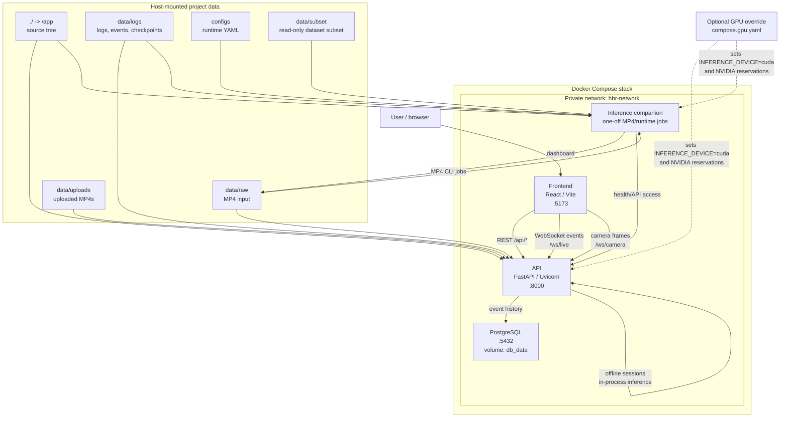

# Architecture

[Back to README](../README.md)

This page summarizes the system shape that is currently visible in `compose.yaml`, `compose.gpu.yaml`, and the FastAPI route wiring. It is a draft documentation pass while issue #130 is still pending; final checkpoint release details and final performance numbers are not available yet.

## Compose Topology



The API and inference services share the source tree mounted at `/app`. The API runs offline sessions in-process through the inference service API, while the `inference` container remains available for startup checks and one-off `docker compose run --rm inference ...` MP4 jobs.

## Service Responsibilities

- `frontend`: React/Vite dashboard on [Frontend](http://localhost:5173). It proxies REST calls to `/api` and WebSocket calls to `/ws` during development.
- `api`: FastAPI backend on [Swagger UI / OpenAPI docs](http://localhost:8000/docs), [ReDoc API docs](http://localhost:8000/redoc), and [API health](http://localhost:8000/health). It owns sessions, uploads, event history, WebSocket handling, persistence calls, and structured logs.
- `db`: PostgreSQL event history database with the named `db_data` volume.
- `inference`: Companion container for inference startup summary and one-off MP4 commands. It mounts raw data, logs, configs, and subset data.
- `compose.gpu.yaml`: Optional NVIDIA GPU override for `api` and `inference`, setting CUDA-related environment variables and device reservations.

## API and WebSocket Surface

Detailed schemas and examples live in [Backend](backend.md). The live OpenAPI renderers are [Swagger UI / OpenAPI docs](http://localhost:8000/docs) and [ReDoc API docs](http://localhost:8000/redoc).

Important REST paths currently wired by the application:

- `GET /health` - health/liveness check.
- `GET /readiness` - readiness placeholder.
- `GET /api/` - API root.
- `POST /api/videos/upload` - upload an operator-selected MP4 to `data/uploads`.
- `POST /api/sessions/` - start an asynchronous offline inference session from `video_path` or uploaded `video_id`.
- `GET /api/sessions/{session_id}` - read current session status.
- `POST /api/sessions/{session_id}/stop` - request session stop.
- `GET /api/events/` - read persisted detection/alert event history with filters.
- `GET /api/events/sessions` - list session IDs that have stored events.
- `GET /api/events/sessions/{session_id}` - read events for a session.
- `GET /api/events/{event_id}` - read one event payload.

Important WebSocket paths currently wired by the application:

- `WS /ws/live` and `WS /api/websocket/live` - live event stream for `EventPayload` detection and alert messages.
- `WS /ws/camera` and `WS /api/websocket/camera` - browser-camera frame stream. The client sends an initial JSON configuration with `checkpoint_path`, `config_path`, optional `device`, and optional `session_id`, then sends JPEG/WebP binary frames.
- `WS /ws/echo` and `WS /api/websocket/echo` - echo endpoint for basic WebSocket checks.

## Demo Flows

Live camera primary path:

1. User opens the [Frontend](http://localhost:5173).
2. The dashboard connects to `WS /ws/live` for event updates.
3. In Webcam mode, the browser opens the local camera, initializes `WS /ws/camera` with checkpoint/config paths, then sends compressed binary frames.
4. The backend processes frames through the shared inference event pipeline, returns generated events/status on the camera socket, broadcasts events to live listeners, persists events to PostgreSQL, and writes audit/log files under `data/logs`.

This path is implemented in the frontend and backend. Final live demo verification remains dependent on the final checkpoint from issue #130 and the target machine/runtime conditions.

MP4 fallback path:

1. User selects an `.mp4` in the dashboard.
2. The frontend uploads it with `POST /api/videos/upload`; the API stores it under `data/uploads`.
3. The frontend starts `POST /api/sessions/` with the returned `video_id`, checkpoint path, config path, and optional device.
4. The API runs inference in a background thread, writes events to WebSocket/database/audit logs, and exposes status through `GET /api/sessions/{session_id}`.
5. The frontend reads `GET /api/events/sessions/{session_id}` and overlays events during playback.

Scripted demo and benchmark paths:

- [Final Demo Runbook](final-demo-runbook.md) documents `scripts/final_demo_smoke.ps1` and `scripts/run_mp4_inference.ps1`.
- [Performance Benchmark](performance-benchmark.md) documents `scripts/benchmark_mp4_inference.ps1` and `scripts/benchmark_mp4_inference.py`.

## Checkpoint Handling

The expected local checkpoint location is:

```text
data/logs/checkpoints/<checkpoint>.pth
```

Inside Compose containers, that path is available as:

```text
/app/data/logs/checkpoints/<checkpoint>.pth
```

Checkpoint references are passed in three ways:

- `INFERENCE_CHECKPOINT` for the inference service environment.
- `-Checkpoint` for `scripts/run_mp4_inference.ps1` and `scripts/benchmark_mp4_inference.ps1`.
- `checkpoint_path` in REST session requests and the `WS /ws/camera` initialization message.

Current local smoke work may use `baseline_epoch_50.pth`, including the frontend default path. That checkpoint is not final. The final GitHub Release checkpoint link and any final checkpoint name/path remain blocked by issue #130.

## Performance Status

Performance values in [Performance Benchmark](performance-benchmark.md) are current non-final smoke measurements captured with `baseline_epoch_50.pth`. They are useful for checking that the benchmark machinery runs, but they are not final project performance claims.

Final performance must be re-measured after issue #130 publishes the final checkpoint. Do not claim final 15 FPS or <= 2 s compliance unless the final benchmark proves it.

## Known Limitations

- Final checkpoint and final release link are pending issue #130.
- Final performance is pending a benchmark re-run on the final checkpoint.
- Live camera mode is implemented, but final validation depends on the final checkpoint, local camera/browser behavior, and target hardware.
- CPU mode may be slower than GPU mode.
- Smoke benchmarks are not accuracy or model-quality validation.
- The Compose architecture does not currently define a separate inference HTTP API; API-triggered sessions use in-process inference code.
