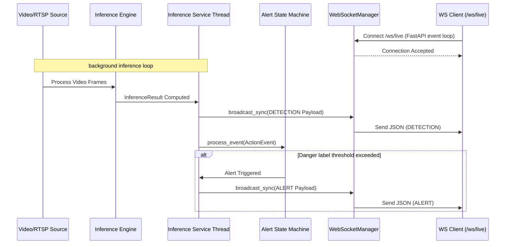

# Backend
## Author: [Szymon Kaźmierczak](https://github.com/Szymon110903)

[Back to README](../README.md)

# Shared Payload Contract (Single Source of Truth)

To ensure consistency across inference producers, FastAPI endpoints, WebSocket streaming, and database persistence, we use a single shared payload contract. The schema uses Pydantic models defined in `src/app/schemas/action_event.py`.

## Schema Definition

### EventPayload (Wrapper)

All events emitted in the system are wrapped in an `EventPayload` structure.

```json
{
  "event_id": "uuid",
  "timestamp": "ISO-8601 UTC timestamp",
  "camera_id": "string (optional)",
  "version": "string",
  "event_type": "string (DETECTION or ALERT)",
  "data": { ... payload dependent on event_type ... }
}
```

### ActionEvent Record (data for event_type: DETECTION)

Represents a single detected action or behavior. Time is relative to the video segment via `start_timestamp`/`end_timestamp` and frame boundaries defined by `start_frame_index`/`end_frame_index`.

```json
{
  "start_frame_index": integer,
  "end_frame_index": integer,
  "label": string,
  "confidence": float,
  "start_timestamp": float (optional),
  "end_timestamp": float (optional),
  "track_id": integer (optional),
  "context": {
    "scene_tag": "string",
    "confidence": float
  } (optional)
}
```

#### Field Descriptions for ActionEvent

| Field | Type | Required | Description |
|-------|------|----------|-------------|
| `start_frame_index` | integer | Yes | Starting frame index of the detection window (0-indexed) |
| `end_frame_index` | integer | Yes | Ending frame index of the detection window (inclusive) |
| `label` | string | Yes | Label of the detected action/behavior class (e.g., "walking", "running") |
| `confidence` | float | Yes | Confidence score of the prediction (0.0 to 1.0) |
| `start_timestamp` | float | No | Starting timestamp in seconds (relative to video start) |
| `end_timestamp` | float | No | Ending timestamp in seconds (relative to video start) |
| `track_id` | integer | No | Tracking ID for multi-object tracking |
| `context` | object | No | Contextual scene information (Sprint 3) |

### AlertData Record (data for event_type: ALERT)

Represents a business-level alert triggered by a detection.

```json
{
  "severity": "string (e.g., HIGH, MEDIUM, LOW)",
  "message": "string",
  "action_event": { ... ActionEvent object ... }
}
```

## Example Payloads

For complete examples of generated JSON events, please refer to the fixtures in `tests/fixtures/payloads/`:
- `tests/fixtures/payloads/detection.json`
- `tests/fixtures/payloads/alert.json`

## Validation Rules

The Pydantic schema enforces:

1. `start_frame_index >= 0`
2. `end_frame_index >= start_frame_index`
3. `0.0 <= confidence <= 1.0`
4. `label` is non-empty string
5. `start_timestamp <= end_timestamp` (if both provided)
6. Enumerated validation for `event_type` (`DETECTION`, `ALERT`).

## Semantics of Time
- **`timestamp`** inside `EventPayload` is an absolute ISO-8601 UTC timestamp representing the real-world time the event was produced.
- **`start_timestamp` / `end_timestamp`** inside `ActionEvent` are floating-point seconds relative to the video or stream start.

## Implementation Files

- **Schema**: `src/app/schemas/action_event.py` - Single source of truth for Pydantic models.
- **Writer**: `src/inference/json_writer.py` - ActionEventWriter for serialization on the inference side.
- **Tests**: `tests/inference/test_action_event.py` - Comprehensive test suite.
This script validates all inference modules and updates the sample file at the canonical location: `tests/inference/data/logs/sample_actions.json`

# Inference Session API

The backend provides asynchronous REST endpoints to manage offline video inference sessions without blocking the main event loop.

## Endpoints

- `POST /api/sessions/`
  - Starts a new inference session in the background.
  - Requires a JSON body with `video_path`, `checkpoint_path`, and `config_path`.
  - Returns HTTP 201 Created with the session ID. Returns HTTP 409 Conflict if the same video is already being processed.
  
- `GET /api/sessions/{session_id}`
  - Retrieves the current status of the session.
  - Returns the session metadata including status (`pending`, `running`, `completed`, `failed`, `stopped`).

- `POST /api/sessions/{session_id}/stop`
  - Safely interrupts an ongoing inference session using a native `threading.Event`.
  - Returns HTTP 202 Accepted if the session is stopped successfully.
  - Returns HTTP 400 Bad Request if the session is already finished.

## Architecture

- **Session Manager:** (`src/app/services/session_manager.py`) Manages state and `asyncio.Task` references in-memory.
- **Background Execution:** Inference is pushed to a background thread using `asyncio.to_thread()` so the FastAPI server remains fully responsive.
- **Graceful Shutdown:** Stopping a session injects a `threading.Event` signal deep into the offline frame producer loop (`src/inference/offline_runtime.py`), causing the video reading loop to break cleanly on the next frame.


# Live WebSocket & Alerting Pipeline

The backend supports near real-time streaming of live behavior detections and system alerts to downstream web clients using WebSockets.

## Endpoints

- `WS /ws/live` (also available as `WS /api/websocket/live`)
  - Accepts incoming client WebSocket connections.
  - Automatically registers the connection with the `WebSocketManager`.
  - Streams `EventPayload` structures (both `DETECTION` and `ALERT` types) in JSON format in real-time.
  - Automatically handles connection cleanup on client disconnect.

- `WS /ws/echo` (also available as `WS /api/websocket/echo`)
  - A simple testing endpoint that echoes client messages back.

## Key Components

### 1. WebSocketManager (`src/app/services/websocket_manager.py`)
Provides a thread-safe singleton wrapper to register, manage, and broadcast events to all active WebSocket connections.
- **Connection Registry:** Holds active FastAPI `WebSocket` connection objects.
- **Thread Safety:** Uses `asyncio.run_coroutine_threadsafe` along with the captured ASGI event loop reference. This allows background inference threads (run via `asyncio.to_thread`) to safely submit broadcast requests back to the main asynchronous event loop.
- **Auto-Cleanup:** If broadcasting to a specific client fails (e.g., due to network dropping), that client is silently disconnected and removed from the active connections pool.

### 2. Runtime Callback Pipeline (`src/inference/offline_runtime.py`)
- Employs an optional callback parameter `on_result: Optional[Callable[[InferenceResult], None]]` on `consume_frame_queue()`, `run_source()`, and `run_source_with_reconnect()`.
- Whenever a valid `InferenceResult` window is computed by the `InferenceEngine`, it is immediately forwarded to the callback rather than waiting for the entire video to finish processing.

### 3. Integrated Alerting Pipeline (`src/inference/service.py`)
- During runtime, the `on_result` callback is mapped to the internal `handle_result` function.
- This function:
  1. Parses the raw model `InferenceResult`.
  2. Builds the canonical `ActionEvent` via `ActionEventWriter`.
  3. Sends a `DETECTION` `EventPayload` message to the `WebSocketManager`.
  4. Feeds the event into the `AlertStateMachine`.
  5. If the state machine triggers a state transition (entering/resolving alert state based on settings like `persistence_threshold`, `resolve_threshold`, and `danger_labels`), it constructs an `AlertData` structure and sends an `ALERT` `EventPayload` to the `WebSocketManager`.

### 4. Configuration & Settings (`src/inference/runtime.py`)
Alert behavior is governed by the `alert` section of the YAML configuration loaded into `InferenceRuntimeSettings`:
- `persistence_threshold`: Number of consecutive frames/windows showing a danger label required to trigger an alert.
- `resolve_threshold`: Number of consecutive frames/windows without danger labels required to resolve an alert.
- `danger_labels`: A list of action labels categorized as dangerous (e.g., `"fall"`, `"violence"`).

---

## Data Flow Diagram



---

## Verification and Testing

Automated tests are written in [test_websocket.py](../tests/app/test_websocket.py). They cover:
- **WebSocket Echo:** Validates standard WebSocket message echo loop.
- **Live Event Broadcasting:** Spawns a mock WebSocket connection client using `TestClient.websocket_connect("/ws/live")`, pushes detection/alert payloads to the singleton `WebSocketManager`, and asserts that the client receives the serialized JSON structures conforming to the Sprint 3 payload contract.

---

# Database Persistence Layer

This section details the database persistence architecture introduced in Sprint 3. The goal of this layer is to persist all system outputs (detections and alerts) generated by the integrated inference pipeline, enabling historical inspection beyond live streaming.

## Architecture Overview

We use **SQLAlchemy 2.0** as our Object Relational Mapper (ORM), with the following configurations:
- **Production/Development Runtime**: **PostgreSQL** database (via `psycopg2-binary`).
- **Testing Runtime**: An in-memory **SQLite** database (`sqlite:///:memory:`). To support multi-threaded test execution (e.g., background inference threads running alongside the FastAPI test client), we utilize `StaticPool` and disable thread checks (`check_same_thread = False`) to share a single in-memory database connection across all threads.

Database sessions and the engine are initialized lazily in `src/app/db/session.py` to prevent import-time side effects and allow configuration overrides during testing.

---

## Database Schema

All persisted events are stored in a single table named `events`. The structure uses metadata columns for indexing/filtering and stores the full, validated `EventPayload` model in a generic `JSON` column to ensure schema compatibility between SQLite (native JSON/Text) and PostgreSQL (native JSONB).

### Table: `events`

| Column Name | SQLAlchemy Type | Constraints | Description |
|---|---|---|---|
| `event_id` | `UUID` | Primary Key | Unique identifier for the event (matches `EventPayload.event_id`). |
| `timestamp` | `DateTime(timezone=True)` | Index, Not Null | Absolute UTC timestamp of the event. |
| `camera_id` | `String` | Index, Nullable | Identifier of the source camera/video. |
| `event_type` | `String` | Index, Not Null | Type of event (e.g., `DETECTION`, `ALERT`). |
| `payload` | `JSON` | Not Null | Complete serialized Pydantic `EventPayload` object. |

---

## Repository Layer

The database interactions are encapsulated in `src/app/db/repository.py`:

- **`save_event(db: Session, payload: EventPayload) -> DBEvent`**:
  Validates the incoming payload, converts it to a `DBEvent` model, and commits it to the database. It handles and logs database write failures, raising a `ValueError` or database-level exception.
- **`get_events(db: Session, event_type: str | None = None, camera_id: str | None = None, limit: int = 100, offset: int = 0) -> Sequence[DBEvent]`**:
  Queries events, sorting them by newest first (`timestamp DESC`), and supports filtering by type or camera ID alongside standard pagination limit/offset.
- **`get_event_by_id(db: Session, event_id: UUID) -> DBEvent | None`**:
  Retrieves a specific event record by its unique UUID.

---

## FastAPI REST Endpoints

Historical records are exposed via the `/api/events` router registered in `src/app/api/routes_impl.py`.

### 1. Get Event and Alert History
- **Endpoint**: `GET /api/events/`
- **Query Parameters**:
  - `event_type`: Filter by event type (`DETECTION` or `ALERT`) (optional).
  - `camera_id`: Filter by source video reference (optional).
  - `limit`: Max records to return (default: `100`, range: `1` to `1000`).
  - `offset`: Pagination offset (default: `0`, min: `0`).
- **Response**: `200 OK` with a list of `EventPayload` objects.

### 2. Get Event by ID
- **Endpoint**: `GET /api/events/{event_id}`
- **Path Parameters**:
  - `event_id`: Unique UUID of the event.
- **Response**: `200 OK` with the matching `EventPayload` object, or `404 Not Found` if the ID does not exist.

---

## Verification and Testing

### Automated Tests
The persistence layer features full test coverage in `tests/app/test_persistence.py`, including:
- Unit tests for repository write and read paths.
- Repository error handling and schema validation.
- FastAPI endpoints query behavior with mock databases.
- Integration tests checking that real/mocked background session events automatically write to the database.

To run the persistence test suite:
```bash
docker compose exec api env PYTHONPATH=. pytest tests/app/test_persistence.py
```

### Manual Verification
1. Run `docker compose up --build` to start the backend with Postgres.
2. Trigger an offline session by POSTing to `/api/sessions/`:
   ```bash
   curl -X POST http://localhost:8000/api/sessions/ \
     -H "Content-Type: application/json" \
     -d '{"video_path": "data/raw/20200423_1727227699855427971146089_1.webp"}'
   ```
3. Read back the history of generated events:
   ```bash
   curl http://localhost:8000/api/events/
   ```

