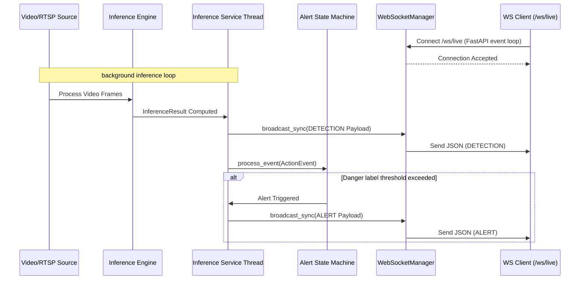

# Backend
## Author: [Szymon Kaźmierczak](https://github.com/Szymon110903)

[Back to README](../README.md)

# Shared Payload Contract (Single Source of Truth)

To ensure consistency across inference producers, FastAPI endpoints, WebSocket streaming, and database persistence, we use a single shared payload contract. The schema uses Pydantic models defined in `src/app/schemas/action_event.py`.

## Schema Definition

### EventPayload (Wrapper)

All events emitted in the system are wrapped in an `EventPayload` structure.

```json
{
  "event_id": "uuid",
  "timestamp": "ISO-8601 UTC timestamp",
  "camera_id": "string (optional)",
  "version": "string",
  "event_type": "string (DETECTION or ALERT)",
  "data": { ... payload dependent on event_type ... }
}
```

### ActionEvent Record (data for event_type: DETECTION)

Represents a single detected action or behavior. Time is relative to the video segment via `start_timestamp`/`end_timestamp` and frame boundaries defined by `start_frame_index`/`end_frame_index`.

```json
{
  "start_frame_index": integer,
  "end_frame_index": integer,
  "label": string,
  "confidence": float,
  "start_timestamp": float (optional),
  "end_timestamp": float (optional),
  "track_id": integer (optional),
  "context": {
    "scene_tag": "string",
    "confidence": float
  } (optional),
  "bboxes": [
    {
      "box_format": "string (optional)",
      "coordinate_space": "string (optional)",
      "frame_index": integer (optional),
      "source_width": integer (optional),
      "source_height": integer (optional),
      "x_min": float (optional),
      "y_min": float (optional),
      "x_max": float (optional),
      "y_max": float (optional),
      "label": "string" (optional),
      "confidence": float (optional)
    }
  ] (optional)
}
```

#### Field Descriptions for ActionEvent

| Field | Type | Required | Description |
|-------|------|----------|-------------|
| `start_frame_index` | integer | Yes | Starting frame index of the detection window (0-indexed) |
| `end_frame_index` | integer | Yes | Ending frame index of the detection window (inclusive) |
| `label` | string | Yes | Label of the detected action/behavior class (e.g., "walking", "running") |
| `confidence` | float | Yes | Confidence score of the prediction (0.0 to 1.0) |
| `start_timestamp` | float | No | Starting timestamp in seconds (relative to video start) |
| `end_timestamp` | float | No | Ending timestamp in seconds (relative to video start) |
| `track_id` | integer | No | Tracking ID for multi-object tracking |
| `context` | object | No | Contextual scene information (Sprint 3) |
| `bboxes` | array | No | List of bounding boxes for objects involved in the event |

### BoundingBox Record (elements of the bboxes array)

Represents spatial information for a single detected object in a frame. The bounding box uses two corners to define a standard 2D axis-aligned rectangle:
- **Top-Left Corner**: `(x_min, y_min)`
- **Bottom-Right Corner**: `(x_max, y_max)`

The frontend can calculate the remaining points (`(x_max, y_min)` and `(x_min, y_max)`) from these.

```json
{
  "box_format": "string (optional)",
  "coordinate_space": "string (optional)",
  "frame_index": integer (optional),
  "source_width": integer (optional),
  "source_height": integer (optional),
  "x_min": float (optional),
  "y_min": float (optional),
  "x_max": float (optional),
  "y_max": float (optional),
  "label": "string" (optional),
  "confidence": float (optional)
}
```

#### Field Descriptions for BoundingBox

| Field | Type | Required | Description |
|-------|------|----------|-------------|
| `box_format` | string | No | Coordinate layout format (e.g., `"xyxy"`, defaults to `"xyxy"`) |
| `coordinate_space` | string | No | Coordinate space type (`"normalized"` for 0.0 to 1.0 relative coordinates, or `"source_pixels"` for absolute pixels) |
| `frame_index` | integer | No | Specific frame index within the video segment where the object was detected |
| `source_width` | integer | No | Width in pixels of the source video frame |
| `source_height` | integer | No | Height in pixels of the source video frame |
| `x_min` | float | No | Left boundary coordinate of the bounding box |
| `y_min` | float | No | Top boundary coordinate of the bounding box |
| `x_max` | float | No | Right boundary coordinate of the bounding box |
| `y_max` | float | No | Bottom boundary coordinate of the bounding box |
| `label` | string | No | Classification label of the object (e.g., "car", "person") |
| `confidence` | float | No | Confidence score of the object detection (0.0 to 1.0) |

### AlertData Record (data for event_type: ALERT)

Represents a business-level alert triggered by a detection.

```json
{
  "severity": "string (e.g., HIGH, MEDIUM, LOW)",
  "message": "string",
  "action_event": { ... ActionEvent object ... }
}
```

## Example Payloads

For complete examples of generated JSON events, please refer to the fixtures in `tests/fixtures/payloads/`:
- `tests/fixtures/payloads/detection.json`
- `tests/fixtures/payloads/alert.json`

## Validation Rules

The Pydantic schema enforces:

1. `start_frame_index >= 0`
2. `end_frame_index >= start_frame_index`
3. `0.0 <= confidence <= 1.0`
4. `label` is non-empty string
5. `start_timestamp <= end_timestamp` (if both provided)
6. `x_max >= x_min` and `y_max >= y_min` in `BoundingBox` (if both coordinates in a pair are provided)
7. `0.0 <= confidence <= 1.0` in `BoundingBox` (if provided)
8. `frame_index >= 0` in `BoundingBox` (if provided)
9. `source_width > 0` and `source_height > 0` in `BoundingBox` (if provided)
10. Enumerated validation for `event_type` (`DETECTION`, `ALERT`).

## Semantics of Time
- **`timestamp`** inside `EventPayload` is an absolute ISO-8601 UTC timestamp representing the real-world time the event was produced.
- **`start_timestamp` / `end_timestamp`** inside `ActionEvent` are floating-point seconds relative to the video or stream start.

## Implementation Files

- **Schema**: `src/app/schemas/action_event.py` - Single source of truth for Pydantic models.
- **Writer**: `src/inference/json_writer.py` - ActionEventWriter for serialization on the inference side.
- **Tests**: `tests/inference/test_action_event.py` - Comprehensive test suite.
This script validates all inference modules and updates the sample file at the canonical location: `tests/inference/data/logs/sample_actions.json`

# Inference Session API

The backend provides asynchronous REST endpoints to manage offline video inference sessions without blocking the main event loop.

## Endpoints

- `POST /api/sessions/`
  - Starts a new inference session in the background.
  - Requires a JSON body with `video_path`, `checkpoint_path`, and `config_path`.
  - Returns HTTP 201 Created with the session ID. Returns HTTP 409 Conflict if the same video is already being processed.
  
- `GET /api/sessions/{session_id}`
  - Retrieves the current status of the session.
  - Returns the session metadata including status (`pending`, `running`, `completed`, `failed`, `stopped`).

- `POST /api/sessions/{session_id}/stop`
  - Safely interrupts an ongoing inference session using a native `threading.Event`.
  - Returns HTTP 202 Accepted if the session is stopped successfully.
  - Returns HTTP 400 Bad Request if the session is already finished.

## Architecture

- **Session Manager:** (`src/app/services/session_manager.py`) Manages state and `asyncio.Task` references in-memory.
- **Background Execution:** Inference is pushed to a background thread using `asyncio.to_thread()` so the FastAPI server remains fully responsive.
- **Graceful Shutdown:** Stopping a session injects a `threading.Event` signal deep into the offline frame producer loop (`src/inference/offline_runtime.py`), causing the video reading loop to break cleanly on the next frame.


# Live WebSocket & Alerting Pipeline

The backend supports near real-time streaming of live behavior detections and system alerts to downstream web clients using WebSockets.

## Endpoints

- `WS /ws/live` (also available as `WS /api/websocket/live`)
  - Accepts incoming client WebSocket connections.
  - Automatically registers the connection with the `WebSocketManager`.
  - Streams `EventPayload` structures (both `DETECTION` and `ALERT` types) in JSON format in real-time.
  - Automatically handles connection cleanup on client disconnect.

- `WS /ws/echo` (also available as `WS /api/websocket/echo`)
  - A simple testing endpoint that echoes client messages back.

## Key Components

### 1. WebSocketManager (`src/app/services/websocket_manager.py`)
Provides a thread-safe singleton wrapper to register, manage, and broadcast events to all active WebSocket connections.
- **Connection Registry:** Holds active FastAPI `WebSocket` connection objects.
- **Thread Safety:** Uses `asyncio.run_coroutine_threadsafe` along with the captured ASGI event loop reference. This allows background inference threads (run via `asyncio.to_thread`) to safely submit broadcast requests back to the main asynchronous event loop.
- **Auto-Cleanup:** If broadcasting to a specific client fails (e.g., due to network dropping), that client is silently disconnected and removed from the active connections pool.

### 2. Runtime Callback Pipeline (`src/inference/offline_runtime.py`)
- Employs an optional callback parameter `on_result: Optional[Callable[[InferenceResult], None]]` on `consume_frame_queue()`, `run_source()`, and `run_source_with_reconnect()`.
- Whenever a valid `InferenceResult` window is computed by the `InferenceEngine`, it is immediately forwarded to the callback rather than waiting for the entire video to finish processing.

### 3. Integrated Alerting Pipeline (`src/inference/service.py`)
- During runtime, the `on_result` callback is mapped to the internal `handle_result` function.
- This function:
  1. Parses the raw model `InferenceResult`.
  2. Builds the canonical `ActionEvent` via `ActionEventWriter`.
  3. Sends a `DETECTION` `EventPayload` message to the `WebSocketManager`.
  4. Feeds the event into the `AlertStateMachine`.
  5. If the state machine triggers a state transition (entering/resolving alert state based on settings like `persistence_threshold`, `resolve_threshold`, and `danger_labels`), it constructs an `AlertData` structure and sends an `ALERT` `EventPayload` to the `WebSocketManager`.

### 4. Configuration & Settings (`src/inference/runtime.py`)
Alert behavior is governed by the `alert` section of the YAML configuration loaded into `InferenceRuntimeSettings`:
- `persistence_threshold`: Number of consecutive frames/windows showing a danger label required to trigger an alert.
- `resolve_threshold`: Number of consecutive frames/windows without danger labels required to resolve an alert.
- `danger_labels`: A list of action labels categorized as dangerous (e.g., `"fall"`, `"violence"`).

---

## Data Flow Diagram



---

## Verification and Testing

Automated tests are written in [test_websocket.py](../tests/app/test_websocket.py). They cover:
- **WebSocket Echo:** Validates standard WebSocket message echo loop.
- **Live Event Broadcasting:** Spawns a mock WebSocket connection client using `TestClient.websocket_connect("/ws/live")`, pushes detection/alert payloads to the singleton `WebSocketManager`, and asserts that the client receives the serialized JSON structures conforming to the Sprint 3 payload contract.
