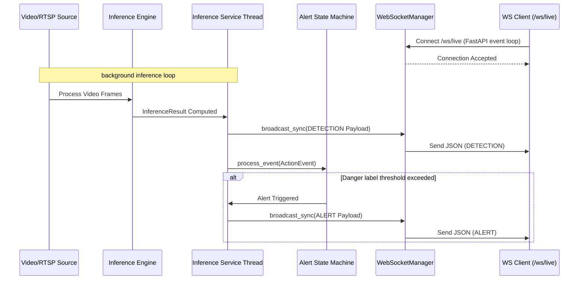

# Backend
## Author: [Szymon Kaźmierczak](https://github.com/Szymon110903)

[Back to README](../README.md)

## API Surface Quick Reference

Live API documentation:

- [Swagger UI / OpenAPI docs](http://localhost:8000/docs)
- [ReDoc API docs](http://localhost:8000/redoc)
- [API health](http://localhost:8000/health)

REST paths currently wired by `src/app/app.py` and `src/app/api/routes_impl.py`:

- `GET /health` - liveness check.
- `GET /readiness` - readiness placeholder.
- `GET /api/` - API root.
- `POST /api/videos/upload` - upload an operator-selected MP4 and return a `video_id`.
- `POST /api/sessions/` - start an asynchronous offline inference session.
- `GET /api/sessions/{session_id}` - retrieve session status.
- `POST /api/sessions/{session_id}/stop` - stop a pending or running session.
- `GET /api/events/` - retrieve persisted detection/alert history with optional filters.
- `GET /api/events/sessions` - list session IDs with stored events.
- `GET /api/events/sessions/{session_id}` - retrieve events for one session.
- `GET /api/events/{event_id}` - retrieve one event payload.

WebSocket paths currently wired by `src/app/api/websocket.py`:

- `WS /ws/live` and `WS /api/websocket/live` - live detection/alert event stream.
- `WS /ws/camera` and `WS /api/websocket/camera` - browser-camera binary frame stream with initial checkpoint/config JSON.
- `WS /ws/echo` and `WS /api/websocket/echo` - echo endpoint for basic WebSocket checks.

# Shared Payload Contract (Single Source of Truth)

To ensure consistency across inference producers, FastAPI endpoints, WebSocket streaming, and database persistence, we use a single shared payload contract. The schema uses Pydantic models defined in `src/app/schemas/action_event.py`.

## Schema Definition

### EventPayload (Wrapper)

All events emitted in the system are wrapped in an `EventPayload` structure.

```json
{
  "event_id": "uuid",
  "timestamp": "ISO-8601 UTC timestamp",
  "camera_id": "string (optional)",
  "version": "string",
  "event_type": "string (DETECTION or ALERT)",
  "data": { ... payload dependent on event_type ... }
}
```

### ActionEvent Record (data for event_type: DETECTION)

Represents a single detected action or behavior. Time is relative to the video segment via `start_timestamp`/`end_timestamp` and frame boundaries defined by `start_frame_index`/`end_frame_index`.

```json
{
  "start_frame_index": integer,
  "end_frame_index": integer,
  "label": string,
  "confidence": float,
  "start_timestamp": float (optional),
  "end_timestamp": float (optional),
  "track_id": integer (optional),
  "context": {
    "scene_tag": "string",
    "confidence": float
  } (optional),
  "bboxes": [
    {
      "box_format": "string (optional)",
      "coordinate_space": "string (optional)",
      "frame_index": integer (optional),
      "source_width": integer (optional),
      "source_height": integer (optional),
      "x_min": float (optional),
      "y_min": float (optional),
      "x_max": float (optional),
      "y_max": float (optional),
      "label": "string" (optional),
      "confidence": float (optional)
    }
  ] (optional)
}
```

#### Field Descriptions for ActionEvent

| Field | Type | Required | Description |
|-------|------|----------|-------------|
| `start_frame_index` | integer | Yes | Starting frame index of the detection window (0-indexed) |
| `end_frame_index` | integer | Yes | Ending frame index of the detection window (inclusive) |
| `label` | string | Yes | Label of the detected action/behavior class (e.g., "walking", "running") |
| `confidence` | float | Yes | Confidence score of the prediction (0.0 to 1.0) |
| `start_timestamp` | float | No | Starting timestamp in seconds (relative to video start) |
| `end_timestamp` | float | No | Ending timestamp in seconds (relative to video start) |
| `track_id` | integer | No | Tracking ID for multi-object tracking |
| `context` | object | No | Contextual scene information (Sprint 3) |
| `bboxes` | array | No | List of bounding boxes for objects involved in the event |

### BoundingBox Record (elements of the bboxes array)

Represents spatial information for a single detected object in a frame. The bounding box uses two corners to define a standard 2D axis-aligned rectangle:
- **Top-Left Corner**: `(x_min, y_min)`
- **Bottom-Right Corner**: `(x_max, y_max)`

The frontend can calculate the remaining points (`(x_max, y_min)` and `(x_min, y_max)`) from these.

```json
{
  "box_format": "string (optional)",
  "coordinate_space": "string (optional)",
  "frame_index": integer (optional),
  "source_width": integer (optional),
  "source_height": integer (optional),
  "x_min": float (optional),
  "y_min": float (optional),
  "x_max": float (optional),
  "y_max": float (optional),
  "label": "string" (optional),
  "confidence": float (optional)
}
```

#### Field Descriptions for BoundingBox

| Field | Type | Required | Description |
|-------|------|----------|-------------|
| `box_format` | string | No | Coordinate layout format (e.g., `"xyxy"`, defaults to `"xyxy"`) |
| `coordinate_space` | string | No | Coordinate space type (`"normalized"` for 0.0 to 1.0 relative coordinates, or `"source_pixels"` for absolute pixels) |
| `frame_index` | integer | No | Specific frame index within the video segment where the object was detected |
| `source_width` | integer | No | Width in pixels of the source video frame |
| `source_height` | integer | No | Height in pixels of the source video frame |
| `x_min` | float | No | Left boundary coordinate of the bounding box |
| `y_min` | float | No | Top boundary coordinate of the bounding box |
| `x_max` | float | No | Right boundary coordinate of the bounding box |
| `y_max` | float | No | Bottom boundary coordinate of the bounding box |
| `label` | string | No | Classification label of the object (e.g., "car", "person") |
| `confidence` | float | No | Confidence score of the object detection (0.0 to 1.0) |

### Object Detection & Bounding Box Generation (Issue #119)

#### Detection Pipeline

Bounding boxes are generated by `BBoxEnricher` (`src/inference/bbox_detector.py`), which runs between context enrichment and alert processing in `InferenceEventPipeline`:

```
ActionEvent (context attached) → BBoxEnricher → ActionEvent.bboxes populated → alert processing
```

- **Detector**: A pretrained YOLO model (`yolov8n.pt` via `ultralytics`) — no detector is trained or fine-tuned.
- **Representative frame**: Detection runs once per inference window on a single frame (`first`/`middle`/`last`, configurable), not on every raw frame.
- **Label-to-class filtering**: Raw detections are filtered to only the object classes relevant to the predicted action label via `ACTION_LABEL_TO_OBJECT_CLASSES`:

  | Action label | Allowed object classes |
  |---|---|
  | `car_drops_off_person` | `car`, `person` |
  | `car_makes_u_turn` | `car` |
  | `motorcycle_makes_u_turn` | `motorcycle` |
  | `motorcycle_turns_right` | `motorcycle` |
  | `person_sits_down` | `person` |

  No mapping or no matching detections → `bboxes=None` (never an empty list, never a crash).

- **Integration**: `BBoxEnricher.__call__(event, result)` implements the pipeline's `BBoxHook` contract and is passed as `bbox_hook=`. Exceptions inside the hook are caught by the pipeline — a failing detector degrades to `bboxes=None`, never interrupts inference.

#### Known Limitations

> **This is event-related object overlay, not full spatio-temporal action localization.** The detector reports which objects are present on one representative frame — it does not track motion across the window, attribute causal responsibility for the action to a specific object, or localize the action in time.

Other limitations: detection quality depends entirely on the pretrained model and footage conditions; only one frame per window is inspected (objects occluded on that frame produce no bbox); `confidence_threshold` (default `0.4`) is a single global cutoff, not tuned per label or class.

#### Testing

`tests/inference/test_bbox_detector.py` uses a fake `ObjectDetector` so CI never downloads real weights. Manual verification against footage in `data/raw/` confirmed sensible detections before merge.

### AlertData Record (data for event_type: ALERT)

Represents a business-level alert triggered by a detection.

```json
{
  "severity": "string (e.g., HIGH, MEDIUM, LOW)",
  "message": "string",
  "action_event": { ... ActionEvent object ... }
}
```

## Example Payloads

For complete examples of generated JSON events, please refer to the fixtures in `tests/fixtures/payloads/`:
- `tests/fixtures/payloads/detection.json`
- `tests/fixtures/payloads/alert.json`

## Validation Rules

The Pydantic schema enforces:

1. `start_frame_index >= 0`
2. `end_frame_index >= start_frame_index`
3. `0.0 <= confidence <= 1.0`
4. `label` is non-empty string
5. `start_timestamp <= end_timestamp` (if both provided)
6. `x_max >= x_min` and `y_max >= y_min` in `BoundingBox` (if both coordinates in a pair are provided)
7. `0.0 <= confidence <= 1.0` in `BoundingBox` (if provided)
8. `frame_index >= 0` in `BoundingBox` (if provided)
9. `source_width > 0` and `source_height > 0` in `BoundingBox` (if provided)
10. Enumerated validation for `event_type` (`DETECTION`, `ALERT`).

## Semantics of Time
- **`timestamp`** inside `EventPayload` is an absolute ISO-8601 UTC timestamp representing the real-world time the event was produced.
- **`start_timestamp` / `end_timestamp`** inside `ActionEvent` are floating-point seconds relative to the video or stream start.

## Implementation Files

- **Schema**: `src/app/schemas/action_event.py` - Single source of truth for Pydantic models.
- **Writer**: `src/inference/json_writer.py` - ActionEventWriter for serialization on the inference side.
- **Tests**: `tests/inference/test_action_event.py` - Comprehensive test suite.
This script validates all inference modules and updates the sample file at the canonical location: `tests/inference/data/logs/sample_actions.json`

# Inference Session API

The backend provides asynchronous REST endpoints to manage offline video inference sessions without blocking the main event loop.

## Endpoints

- `POST /api/sessions/`
  - Starts a new inference session in the background.
  - Requires a JSON body with `video_path`, `checkpoint_path`, and `config_path`.
  - Returns HTTP 201 Created with the session ID. Returns HTTP 409 Conflict if the same video is already being processed.
  
- `GET /api/sessions/{session_id}`
  - Retrieves the current status of the session.
  - Returns the session metadata including status (`pending`, `running`, `completed`, `failed`, `stopped`).

- `POST /api/sessions/{session_id}/stop`
  - Safely interrupts an ongoing inference session using a native `threading.Event`.
  - Returns HTTP 202 Accepted if the session is stopped successfully.
  - Returns HTTP 400 Bad Request if the session is already finished.

## Architecture

- **Session Manager:** (`src/app/services/session_manager.py`) Manages state and `asyncio.Task` references in-memory.
- **Background Execution:** Inference is pushed to a background thread using `asyncio.to_thread()` so the FastAPI server remains fully responsive.
- **Graceful Shutdown:** Stopping a session injects a `threading.Event` signal deep into the offline frame producer loop (`src/inference/offline_runtime.py`), causing the video reading loop to break cleanly on the next frame.


# Live WebSocket & Alerting Pipeline

The backend supports near real-time streaming of live behavior detections and system alerts to downstream web clients using WebSockets.

## Endpoints

- `WS /ws/live` (also available as `WS /api/websocket/live`)
  - Accepts incoming client WebSocket connections.
  - Automatically registers the connection with the `WebSocketManager`.
  - Streams `EventPayload` structures (both `DETECTION` and `ALERT` types) in JSON format in real-time.
  - Automatically handles connection cleanup on client disconnect.

- `WS /ws/echo` (also available as `WS /api/websocket/echo`)
  - A simple testing endpoint that echoes client messages back.

- `WS /ws/camera` (also available as `WS /api/websocket/camera`)
  - Accepts incoming client WebSocket connections from browser camera sources.
  - Requires an initial JSON text message to initialize the inference model pipeline:
    ```json
    {
      "checkpoint_path": "string (absolute path to the model checkpoint file)",
      "config_path": "string (absolute path to the runtime configuration file)",
      "device": "string (optional, e.g. 'cpu' or 'cuda')",
      "session_id": "string (optional UUID format; generated if not provided)"
    }
    ```
  - After successful initialization, expects a continuous stream of binary frames (JPEG or WebP data).
  - Accepts a text message `"stop"` to cleanly terminate the streaming session.
  - Sends back two categories of JSON messages:
    1. **Events**: Standard `EventPayload` structures (both `DETECTION` and `ALERT` types) generated during streaming.
    2. **Status Messages**: Lifecycle and error events distinct from detection payloads.
    
    ##### Non-Event Status Message Envelope
    ```json
    {
      "message_type": "STATUS",
      "session_id": "string (UUID)",
      "status": "initialization_failed" | "initialized" | "running" | "stopped" | "failed",
      "message": "Descriptive status message details",
      "error": "Optional traceback or technical error details",
      "error_type": "Optional exception class name"
    }
    ```

## Key Components

### 1. WebSocketManager (`src/app/services/websocket_manager.py`)
Provides a thread-safe singleton wrapper to register, manage, and broadcast events to all active WebSocket connections.
- **Connection Registry:** Holds active FastAPI `WebSocket` connection objects.
- **Thread Safety:** Uses `asyncio.run_coroutine_threadsafe` along with the captured ASGI event loop reference. This allows background inference threads (run via `asyncio.to_thread`) to safely submit broadcast requests back to the main asynchronous event loop.
- **Auto-Cleanup:** If broadcasting to a specific client fails (e.g., due to network dropping), that client is silently disconnected and removed from the active connections pool.

### 2. Runtime Callback Pipeline (`src/inference/offline_runtime.py`)
- Employs an optional callback parameter `on_result: Optional[Callable[[InferenceResult], None]]` on `consume_frame_queue()`, `run_source()`, and `run_source_with_reconnect()`.
- Whenever a valid `InferenceResult` window is computed by the `InferenceEngine`, it is immediately forwarded to the callback rather than waiting for the entire video to finish processing.

### 3. Integrated Alerting Pipeline (`src/inference/service.py`)
- During runtime, the `on_result` callback is mapped to the internal `handle_result` function.
- This function:
  1. Parses the raw model `InferenceResult`.
  2. Builds the canonical `ActionEvent` via `ActionEventWriter`.
  3. Sends a `DETECTION` `EventPayload` message to the `WebSocketManager`.
  4. Feeds the event into the `AlertStateMachine`.
  5. If the state machine triggers a state transition (entering/resolving alert state based on settings like `persistence_threshold`, `resolve_threshold`, and `danger_labels`), it constructs an `AlertData` structure and sends an `ALERT` `EventPayload` to the `WebSocketManager`.

### 4. Configuration & Settings (`src/inference/runtime.py`)
Alert behavior is governed by the `alert` section of the YAML configuration loaded into `InferenceRuntimeSettings`:
- `persistence_threshold`: Number of consecutive frames/windows showing a danger label required to trigger an alert.
- `resolve_threshold`: Number of consecutive frames/windows without danger labels required to resolve an alert.
- `danger_labels`: A list of action labels categorized as dangerous (e.g., `"fall"`, `"violence"`).

### 5. Camera Session Optimization and Path Security (`src/app/services/camera_stream_manager.py`)
- **Safe Path Validation**: To prevent arbitrary server file reads or directory traversal via client-supplied configurations and checkpoints:
  - Both `checkpoint_path` and `config_path` must resolve to absolute paths.
  - Suffixes are restricted to `.pt`/`.pth` for weights, and `.yml`/`.yaml` for config.
  - Paths are validated to exist and must reside strictly within either the current working directory, the container root `/app` (in production/Docker environment), or system temporary directories (for secure automated testing).
- **Model Weight Cache (`ModelCache`)**: To eliminate the latency and memory overhead of reloading neural network models on client reconnects, loaded models are kept in a thread-safe global registry. A `threading.Lock` serializes concurrent accesses from different thread-pool threads while `asyncio.to_thread` guarantees that model loading/lookup never blocks FastAPI's main Event Loop.
- **Real-Time (Non-EOF) Event Flow**: Detections and alerts are evaluated and pushed over the WebSocket immediately as each frame completes. Frontend clients do not need to send `"stop"` or wait for an EOF signal to observe live inference events; the stream remains fully active and observable in real-time.

---

## Data Flow Diagram



---

## Verification and Testing

Automated tests are written in [test_websocket.py](../tests/app/test_websocket.py). They cover:
- **WebSocket Echo:** Validates standard WebSocket message echo loop.
- **Live Event Broadcasting:** Spawns a mock WebSocket connection client using `TestClient.websocket_connect("/ws/live")`, pushes detection/alert payloads to the singleton `WebSocketManager`, and asserts that the client receives the serialized JSON structures conforming to the Sprint 3 payload contract.

Automated streaming contract and idempotency tests are written in [test_stream_event_contract.py](../tests/app/test_stream_event_contract.py). They cover:
- **Streaming Event Emits:** Verifies that detection events are emitted in real-time before reaching EOF (no blocking/buffering).
- **Payload Contract Verification:** Ensures exact payload schema match between MP4 and live Camera streams.
- **Context & Bounding Box Resilience:** Tests that spatial coordinate logic and "unknown" fallback contexts gracefully survive processing without crashing Pydantic schemas.
- **Idempotency & Session Integrity:** Verifies `session_manager` handles consecutive identical files cleanly without deadlocking or state leakage.
- **False Positive Prevention:** Validates the system's ability to debounce consecutive duplicate detections.

---

# Database Persistence Layer

This section details the database persistence architecture introduced in Sprint 3. The goal of this layer is to persist all system outputs (detections and alerts) generated by the integrated inference pipeline, enabling historical inspection beyond live streaming.

## Architecture Overview

We use **SQLAlchemy 2.0** as our Object Relational Mapper (ORM), with the following configurations:
- **Production/Development Runtime**: **PostgreSQL** database (via `psycopg2-binary`).
- **Testing Runtime**: An in-memory **SQLite** database (`sqlite:///:memory:`). To support multi-threaded test execution (e.g., background inference threads running alongside the FastAPI test client), we utilize `StaticPool` and disable thread checks (`check_same_thread = False`) to share a single in-memory database connection across all threads.

Database sessions and the engine are initialized lazily in `src/app/db/session.py` to prevent import-time side effects and allow configuration overrides during testing.

---

## Database Schema

All persisted events are stored in a single table named `events`. The structure uses metadata columns for indexing/filtering and stores the full, validated `EventPayload` model in a generic `JSON` column to ensure schema compatibility between SQLite (native JSON/Text) and PostgreSQL (native JSONB).

### Table: `events`

| Column Name | SQLAlchemy Type | Constraints | Description |
|---|---|---|---|
| `event_id` | `UUID` | Primary Key | Unique identifier for the event (matches `EventPayload.event_id`). |
| `timestamp` | `DateTime(timezone=True)` | Index, Not Null | Absolute UTC timestamp of the event. |
| `camera_id` | `String` | Index, Nullable | Identifier of the source camera/video. |
| `event_type` | `String` | Index, Not Null | Type of event (e.g., `DETECTION`, `ALERT`). |
| `session_id` | `UUID` | Index, Nullable | Optional session UUID from which the event was generated. |
| `payload` | `JSON` | Not Null | Complete serialized Pydantic `EventPayload` object. |

---

## Repository Layer

The database interactions are encapsulated in `src/app/db/repository.py`:

- **`save_event(db: Session, payload: EventPayload) -> DBEvent`**:
  Validates the incoming payload, converts it to a `DBEvent` model, and commits it to the database. It handles and logs database write failures, raising a `ValueError` or database-level exception.
- **`get_events(db: Session, event_type: str | None = None, camera_id: str | None = None, session_id: UUID | None = None, limit: int = 100, offset: int = 0) -> Sequence[DBEvent]`**:
  Queries events, sorting them by newest first (`timestamp DESC`), and supports filtering by type, camera ID, or session ID alongside standard pagination limit/offset.
- **`get_event_by_id(db: Session, event_id: UUID) -> DBEvent | None`**:
  Retrieves a specific event record by its unique UUID.
- **`get_distinct_session_ids(db: Session) -> list[UUID]`**:
  Retrieves all unique, non-null session UUIDs associated with persisted events.

---

## FastAPI REST Endpoints

Historical records are exposed via the `/api/events` router registered in `src/app/api/routes_impl.py`.

### 1. Get Event and Alert History
- **Endpoint**: `GET /api/events/`
- **Query Parameters**:
  - `event_type`: Filter by event type (`DETECTION` or `ALERT`) (optional).
  - `camera_id`: Filter by source video reference (optional).
  - `session_id`: Filter by session UUID (optional).
  - `limit`: Max records to return (default: `100`, range: `1` to `1000`).
  - `offset`: Pagination offset (default: `0`, min: `0`).
- **Response**: `200 OK` with a list of `EventPayload` objects.

### 2. Get All Unique Session IDs
- **Endpoint**: `GET /api/events/sessions`
- **Response**: `200 OK` with a list of unique session UUIDs.

### 3. Get Events by Session ID
- **Endpoint**: `GET /api/events/sessions/{session_id}`
- **Path Parameters**:
  - `session_id`: Unique UUID of the inference session.
- **Query Parameters**:
  - `event_type`: Filter by event type (`DETECTION` or `ALERT`) (optional).
  - `limit`: Max records to return (default: `100`, range: `1` to `1000`).
  - `offset`: Pagination offset (default: `0`, min: `0`).
- **Response**: `200 OK` with a list of matching `EventPayload` objects.

### 4. Get Event by ID
- **Endpoint**: `GET /api/events/{event_id}`
- **Path Parameters**:
  - `event_id`: Unique UUID of the event.
- **Response**: `200 OK` with the matching `EventPayload` object, or `404 Not Found` if the ID does not exist.

---

## Verification and Testing

### Automated Tests
The persistence layer features full test coverage in `tests/app/test_persistence.py`, including:
- Unit tests for repository write and read paths.
- Repository error handling and schema validation.
- FastAPI endpoints query behavior with mock databases.
- Integration tests checking that real/mocked background session events automatically write to the database.

To run the persistence test suite:
```bash
docker compose exec api env PYTHONPATH=. pytest tests/app/test_persistence.py
```

### Manual Verification
1. Run `docker compose up --build` to start the backend with Postgres.
2. Trigger an offline session by POSTing to `/api/sessions/`:
   ```bash
   curl -X POST http://localhost:8000/api/sessions/ \
     -H "Content-Type: application/json" \
     -d '{"video_path": "data/raw/20200423_1727227699855427971146089_1.webp"}'
   ```
3. Read back the history of generated events:
   ```bash
   curl http://localhost:8000/api/events/
   ```


# Backend Logging & Audit Trail

To ensure observability and traceability of backend API lifecycles, background tasks, and critical alert/event pipelines, the application utilizes structured JSON logging and a dual-channel audit trail (database + file output).

## Structured Logging Architecture

The logging system leverages standard Python logging configured with a custom `JsonLogFormatter` that outputs JSON strings to console and files.

- **FastAPI Application (`backend.log`)**:
  Captures the lifecycle of API requests (starting, completed, failed) along with internal server events (e.g. database transactions, background task orchestration). Uses the `hbr.structured` logger namespace.
- **Inference Runtime (`inference.log`)**:
  Captures offline and runtime processing events (e.g. video source initialization, window inference, pipeline failures, performance metrics). Uses the isolated `hbr.structured.inference` logger namespace.
- **Unified Event Format**:
  Every log record outputs a JSON line containing key metadata: `timestamp` (ISO-8601 UTC), `level`, `logger`, `message`, `event`, and optional correlation fields (`session_id` mapping to the request correlation ID).

## HTTP Request Correlation

A global HTTP middleware intercepts incoming requests to establish a correlation context:
1. It reads the `X-Request-ID` HTTP header if provided, or generates a unique UUID4 hex.
2. It sets `request.state.request_id` to this value, which is propagated throughout the request context.
3. Every REST endpoint and background task initialized by a request inherits this ID as their log `session_id`, allowing developers to trace a request end-to-end.
4. The middleware injects `X-Request-ID` back into the client's HTTP response headers.

## Event & Alert Audit Trail

Critical action events (detections and alerts) generated by the system are recorded in two channels:
1. **Database Persistence**: Saved in the `events` table (via SQLAlchemy).
2. **File Audit Log (`audit.log`)**: Every generated event/alert payload is serialized conforming to the `EventPayload` schema and appended as a JSON line to `LOG_DIR/audit.log` for direct local filesystem inspection.

Audit logs follow the canonical JSON schema:
```json
{
  "event_id": "uuid",
  "timestamp": "ISO-8601 UTC timestamp",
  "camera_id": "string (optional)",
  "version": "string",
  "event_type": "DETECTION" or "ALERT",
  "data": { ... payload dependent on event_type ... },
  "session_id": "uuid (corresponds to background session ID)"
}
```

## CORS Configuration

To allow frontend clients (like the React dashboard) to communicate with the FastAPI backend from a different origin, CORS is configured on the application factory using FastAPI's `CORSMiddleware`.

Origins are configurable via the `cors_origins` settings field in [settings.py](../src/app/core/settings.py), which defaults to `["http://localhost:5173", "http://localhost:3000"]` (the standard ports used by the React development server).

