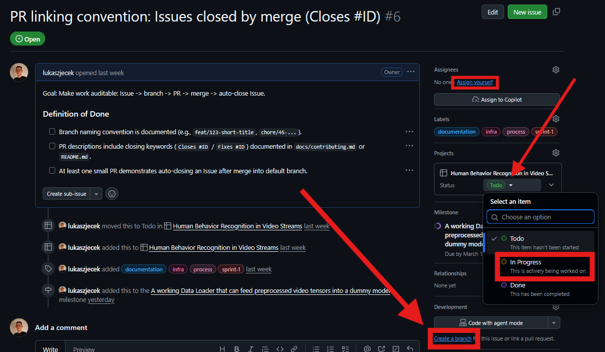
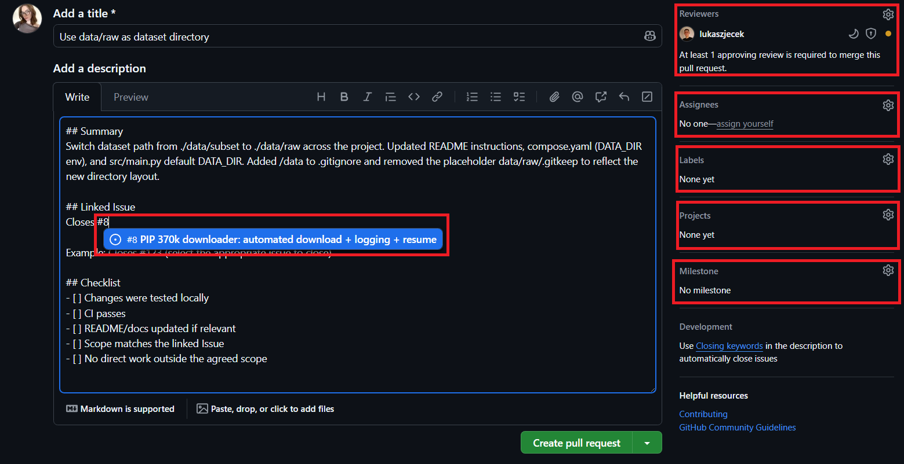

### Workflow

- Every task must start as a GitHub Issue.

- Use the available Issue templates and fill in: Goal, Scope, Definition of Done.

- **Assign yourself**, **create a feature branch** from the Issue and **change Issue status** to "In Progress". 
    

        
    

  

- Do your coding job.

> HINT
> 
> When commiting last commit before creating a Pull Request it is recommended to add Commit Description (besides Commit Summary (`-m` option), which is required) (easiest via [GitHub Desktop](https://desktop.github.com/download/)'s Copilot), so that when you create PR, this Description is already in the PR description body, and then you only cut-paste it into the template's description body.

- Open a Pull Request using the PR template. **The template applies itself automatically when PR is created**. [(see template here)](../.github/pull_request_template.md)

- In the PR description, link the Issue in the `Linked Issue` section, for example: `Closes #123`. Then add **appropriate reviewer**, **assign yourself**, **add** the same **Labels** as these in the related Issue, **choose right** (the only one) **project**, and **choose current sprint's milestone**.
    

        
    

  Finally it looks like this (example):
    

        
    

  

- **Update documentation when the change affects setup, architecture, API, or usage.**