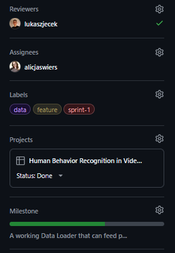

# Contributing

[Back to README](../README.md)

## Workflow

- Every task must start as a GitHub Issue.
- Use the available Issue templates and fill in: Goal, Scope, Definition of Done.
- Assign yourself, create a feature branch from the Issue, and change the Issue status to `In Progress`.

<p>
    
</p>

- Implement the required changes.

> HINT
>
> For the last commit before opening a Pull Request, it is recommended to add a Commit Description in addition to the Commit Summary. This makes it easier to reuse the text in the PR description later.

- Open a Pull Request using the PR template. The template is applied automatically when the PR is created. [(see template here)](../.github/pull_request_template.md)
- In the PR description, link the Issue in the `Linked Issue` section, for example: `Closes #123`.
- Then add the appropriate reviewer, assign yourself, add the same Labels as in the related Issue, choose the correct project, and choose the current sprint milestone.

<p>
    
</p>

Finally it should look similar to this:

<p>
    
</p>

## Repository Rules

- Do not commit directly to `main`.
- All changes must be made on a feature branch and merged through a Pull Request.
- Each Pull Request requires at least one approving review before merge.
- Direct pushes to `main` are blocked by repository rules.
- Repository ownership is defined in `.github/CODEOWNERS`.
- When a Pull Request changes files owned by specific contributors, GitHub automatically requests their review once the PR is ready for review.
- Changes in owned areas should be approved by the relevant code owner before merge.
- Pull Requests are merged into `main` using **Squash** to keep history clean.

## Local Validation Before PR

Run the development container:

```powershell
.\scripts\run.ps1
```

Run tests:

```powershell
.\scripts\test.ps1
```

Run lint checks:

```powershell
.\scripts\lint.ps1
```

If PowerShell blocks scripts from running, set this locally:

```powershell
Set-ExecutionPolicy -Scope CurrentUser RemoteSigned
```

Run CI checks locally:

```bash
python -m pip install --upgrade pip
pip install -r requirements-dev.txt
python -m ruff check .
python -m pytest -q tests
```

## Documentation Rule

Update documentation when the change affects setup, architecture, API, or usage.
